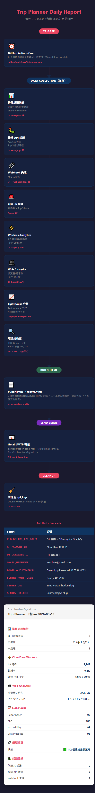

# Trip Planner

專為小團體量身打造的旅遊行程網站，讓每位旅伴都能輕鬆查閱行程、即時掌握天氣與交通資訊。

🔗 **線上 Demo**：[https://trip-planner-dby.pages.dev/](https://trip-planner-dby.pages.dev/)

---

## 功能特色

### 行程瀏覽

- 📋 **多行程支援** — 同時管理多套旅遊計畫，一鍵切換
- 🗓️ **每日時間軸** — 景點、餐廳、購物、飯店依時間排列，清晰呈現一天行程
- 🍽️ **三選一餐廳推薦** — 每個用餐時段提供三間選擇，含評分、價位與地圖連結
- 🗺️ **多地圖支援** — 每個景點直連 Google Maps、Apple Maps、Naver Maps

### 即時資訊

- 🌤️ **天氣預報** — 行程日期在 16 天預報範圍內自動顯示逐時天氣
- 🚗 **交通統計** — 自動計算每日與全程的開車、電車、步行時間總計
- ⏳ **倒數計時器** — 顯示距離出發還有幾天

### 外觀與體驗

- 🌙 **深色模式** — 支援淺色、深色、跟隨系統三種模式
- 🎨 **3 套色彩主題** — 陽光（Sunshine）、晴空（Clear Sky）、和風（Japanese Zen）
- 🖨️ **列印模式** — A4 排版最佳化，可直接列印或輸出 PDF
- 📱 **響應式設計** — 手機、平板、桌機均有對應排版
- ⚡ **PWA 體驗** — 可加入主畫面，離線瀏覽快取

### 旅伴協作

- 💬 **旅伴請求系統** — 傳送「改行程」或「問建議」請求給行程管理員
- 📧 **每日健康日報** — 透過 Gmail 自動寄送當日行程摘要

### 匯出與備份

- 💾 **下載行程** — 支援 PDF、Markdown、JSON、CSV 四種格式

---

## 截圖

> 截圖存放於 `docs/` 目錄。

